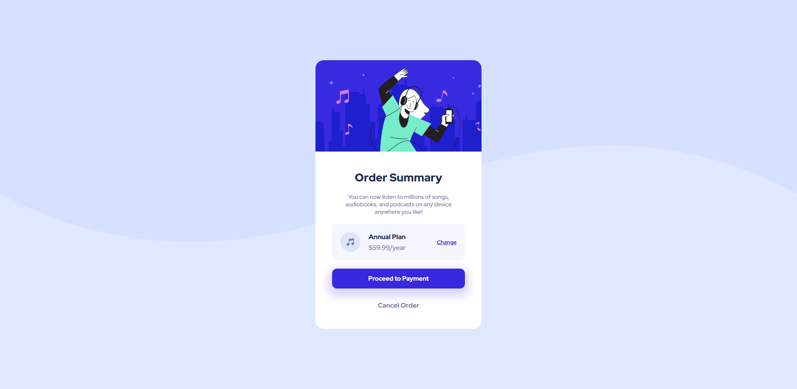

# Frontend Mentor - NFT preview card component solution

This is a solution to the [NFT preview card component challenge on Frontend Mentor](https://www.frontendmentor.io/challenges/nft-preview-card-component-SbdUL_w0U). Frontend Mentor challenges help you improve your coding skills by building realistic projects. 

## Table of contents

- [Overview](#overview)
  - [Screenshot](#screenshot)
  - [Links](#links)
- [My process](#my-process)
  - [Built with](#built-with)
  - [What I learned](#what-i-learned)
- [Author](#author)

## Overview

its been 9 days since I started learning HTML and CSS, This is the 3rd challenege I've done to test myself and each time I do one of these I find it a lot easier.

### Screenshot



### Links

- Solution URL: [Click me!](https://www.frontendmentor.io/solutions/nft-preview-card-component-E8e3-FcAJY)
- Live Site URL: [Click me!](https://johnhaab.github.io/NFT-preview-card-component/)

## My process

First I started with grouping items in my index.html, most of the work was done inside styles.css.

### Built with

- HTML5 markup
- CSS custom properties

### What I learned

I learned and got a better understanding of making something mobile friendly as this is the best I've done so far, I also fond an easier way to center things and get things where I need them.

Code snippets, see below:

```html
  <div class="container">
    <div class="hero">
      
    </div>
    <div class="text-content">
      <div class="title">
        <h2>Order Summary</h2>
        <p>You can now listen to millions of songs, audiobooks, and podcasts on any 
           device anywhere you like!</p>
      </div>
      <div class="plan-box">
        <div class="plan-box-left">
          
          <div>
            <h5>Annual Plan</h5>
            <p>$59.99/year</p>
          </div>
        </div>
        <a href="#" class="change">Change</a>
      </div>
      <a href="" class="proceed-btn">Proceed to Payment</a>
      <a href="" class="cancel-btn">Cancel Order</a>
    </div>
  </div>
```
```css
@media only screen and (max-width: 425px) {
    body {
        background-image: url(images/pattern-background-mobile.svg);
        font-size: 14px;
    }
    .hero img {
        width: 100%;
        height: auto;
    }
    .container {
        max-width: 87%;
        height: 73%;
    }
}
```

## Author

- Frontend Mentor - [@johnhaab](https://www.frontendmentor.io/profile/johnhaab)
- Twitter - [@johnlhaab](https://www.twitter.com/johnlhaab)
